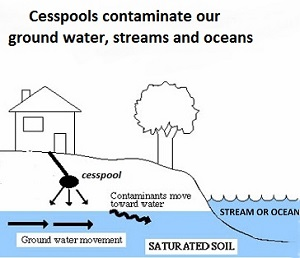

----
Pressures effect the sustainability of the benefits that we receive from the ocean and reduce goal scores. There were 37 pressures that were identified by steakholders and had data available for inclusion into the Hawaiʻi Ocean Health Index. The pressures fall into 6 categories: 1. Alien and invasive species, 2. Climate change, 3. Fishing pressure, 4. Habitat destruction, 5. Pollution, and 6. Social pressures. Pressures were weighted by their potential impact to each goal. The pressures that received the highest weight or impact on ocean health were pollution (land based sources of pollution), sea level rise and ocean warming caused by climate change, and habitat destruction. Here we describe these major pressures and their potential impact on the future of Hawaii's Ocean Health.

## Land Based Sources of Pollution
There is a direct connection between mauka and makai (land and sea) when it comes to water quality and ocean pollution. Ocean pollution can come from a variety of land use practices such as from pesticides and fertilizers used for agriculture and golf courses, land development through increasing impervious surfaces that do not allow for the absorption and filtering of water contaminants before they reach the ocean, and from wastewater sources such as cesspools.

###Agriculture and Golf Courses 

###Land Development
% of impervious surfaces per watershed

###Cesspools

 

DOH Wastewater Branch
Cesspools or one site disposal systems store human waste but are known to leak and leach this waste and accompanying pathogens into our land, streams, and ultimately our ocean. It is estimated that cesspools release 53 million gallons of untreated sewage into the ground each day (DOH). Currently there are approximately 88,000 cesspools in the State (DOH). These pathogens are not only harmful to our oceans, they are also dangerous to us, causing beach closures and restricting our use of the ocean. The State of Hawaiʻi is working to convert and eliminate cesspools through the 2017 Act 125 which requires the replacement of all cesspools by 2050. 

Infographic and more information on cesspools is available through the State of Hawaii Department of Health Wastewater Branch [here](http://health.hawaii.gov/wastewater/cesspools/).

 

## Climate Change
Climate change poses a huge threat to our coral reefs, coastal communities, and Hawaii's economy. 

Sea level rise is projected to raise sea level by 3.2 feet by 2100 (IPPC 2014) and cause increased coastal erosion and inundation, furthering the importance of our coastal habitats to buffer against these changing ocean conditions ([Hawaiʻi Climate Change Mitigation and Adaptation Commission](https://climateadaptation.hawaii.gov/wp-content/uploads/2017/12/SLR-Report_Dec2017.pdf)). A 3.2 foot rise in sea level is estimated to flood 25,800 acres and compromise 6,500 structures, resulting in 20,000 residents displaced and substantial economic loss ($19 billion). The projected sea level rise is also predicted to cause flooding in over 2,000 cesspools, further reducing nearshore water quality and harming coral reef ecosystems. 

We are already seeing the impacts of climate change on Hawaiiʻs coral reef ecosystems. Hawaiiʻs Coral reef condition declined drastically with recent coral bleaching events in 2014 and 2015. Long periods of warmer than normal temperatures, water pollution, and overexposure to sunlight can cause corals to become stressed and can lead to coral bleaching were corals loose the algae within their cells that give them their characteristic color and help support coral health and growth. If the the environmental conidtions do not improve bleached coral can die or become diseased.

 

Infrographic provided by NOAA National Ocean Service [here](https://oceanservice.noaa.gov/facts/coral_bleach.html).

Follow coral bleaching alert levels [here](https://coralreefwatch.noaa.gov/vs/gauges/hawaii.php).

 

## Human Impacts
###Habitat Modification

###Fishing

###Human Use and Trampling 
