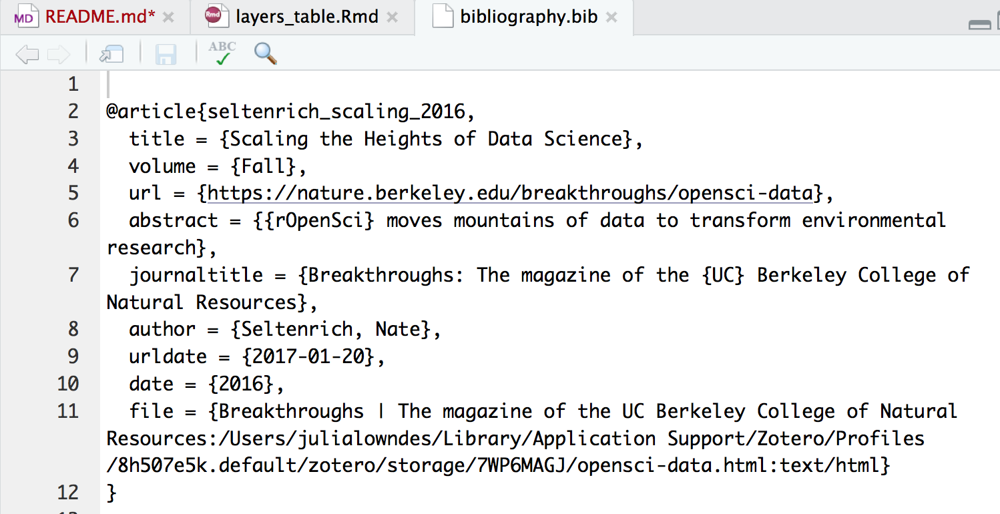

## Creating and displaying the ohi-science.org/mhi/layers_table.html

There are a few steps involved with getting the correct layers on the MHI dashboard. All the layer information comes from [Eva's data_layers.csv](https://github.com/OHI-Science/mhi/blob/master/prep/data_layers.csv), which includes references in either Zotero/Mendeley that will be exported as a `.bib` file

1. Make any changes to the Zotero/Mendeley folder. Export the collection as a `OHI_Hawaii.bib`; resave/overwrite it to the master branch's region2017/conf/web. 
1. Make any changes to data_layers.csv. If you're adding to the "Bib" column, make sure that the reference name starts with an `@`. So for example in the screenshot below, the information you'd add to the "Bib" column would be: `@seltenrich_scaling_2016`
1. Rerun [layers_table.Rmd](https://github.com/OHI-Science/mhi/blob/master/region2017/conf/web/layers_table.Rmd). This pulls from data_layers.csv and will render/knit a table.
1. Commit and push!
1. Then, in the gh-pages branch, re-render the layers_table.Rmd file, which will copy and call the master branch's version and insert it into the page. 

 

 table displaying 
